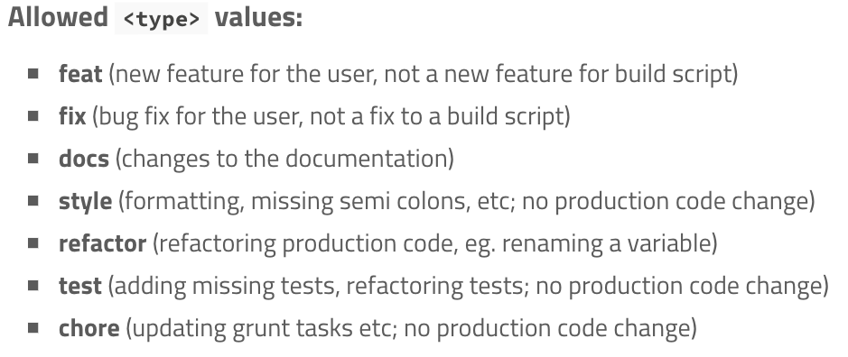

# Semantic Commit Messages

- 검색하게 편하도록 태그는 []:
- 커밋 메시지의 시작은 영어 대문자 동사로 시작.

## 커밋 메세지 정리

- feat: 페이지(html), 함수(js)가 새로 추가됨
- fix: 페이지(html), 함수(js)가 수정됨
- refactor: 페이지(html), 함수(js) 가 필요없어서 삭제하거나, 이름이 마음에 안들어서 바꿈
- style: 스타일(css)이 추가, 수정, 삭제되거나 html 이랑 link 됨
- docs: 문서(md)가 추가, 수정, 삭제됨
- test: 테스트 코드를 추가, 수정 삭제함
- chore: 그외 기타

## 참고 링크

- [gist.github.com](https://gist.github.com/joshbuchea/6f47e86d2510bce28f8e7f42ae84c716)
- [seesparkbox.com](https://seesparkbox.com/foundry/semantic_commit_messages)
- [conventionalcommits.org](https://www.conventionalcommits.org/en/v1.0.0/)
- [karma-runner](http://karma-runner.github.io/1.0/dev/git-commit-msg.html)
